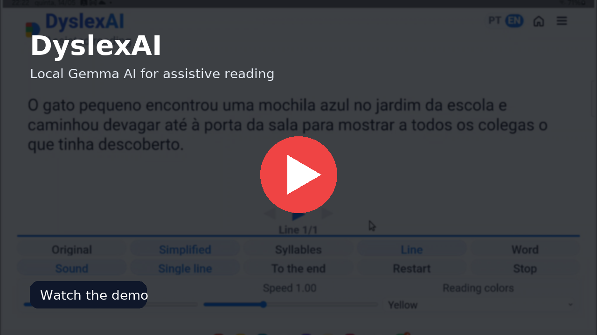

# DyslexAI — Multimodal Assistive Reading for Dyslexic Students with Local Gemma AI

**DyslexAI** is an Android assistive reading application that helps dyslexic students read educational content with less cognitive overload by combining local Gemma multimodal inference, text simplification, guided reading, syllable support, oral reading practice, speech transcription, and supportive feedback.

Built for the **Kaggle Gemma 4 Good Hackathon**, the final submission is centered on a real Android mobile experience powered locally by Gemma / LiteRT-LM.

## Demo video

[](https://www.youtube.com/watch?v=iGtbTc_InLY)

## Why it matters

Dyslexic students may face more than difficulty decoding words. Reading can involve line skipping, trouble keeping focus, long sentences, dense educational text, frustration, and anxiety when asked to read aloud.

DyslexAI is designed to reduce that friction between the student and the page. Instead of treating accessibility as a single feature, it combines several forms of support inside one guided reading flow.

## Origin of the project

DyslexAI was inspired by a real father-and-son collaboration and shaped by feedback from a Portuguese teacher with a special-education perspective. That origin kept the project grounded in a practical question: how can AI make school reading feel less overwhelming and more humane for a child who needs support?

## What DyslexAI does

From the Android app, a student can:

- capture or select textbook and worksheet images;
- use local Gemma multimodal inference to interpret educational image content;
- generate simplified text from dense material;
- read with line-by-line and word-by-word guidance;
- optionally display syllable-separated text;
- generate adaptive reading-practice phrases;
- read aloud while the app listens;
- transcribe spoken reading;
- compare spoken reading with the expected text;
- receive supportive feedback for continued practice.

## Why local AI matters

DyslexAI uses local AI because educational accessibility tools should be practical in the places where children actually read. After setup, on-device inference supports:

- greater privacy for school material and spoken reading;
- offline-first use after the model is installed;
- better accessibility in settings with weaker connectivity;
- portability across real school and home environments;
- lower dependency on cloud services;
- a real Android deployment rather than only a hosted prototype.

## Architecture overview

```text
Android app
  -> Vue interface
  -> Capacitor bridge / plugin
  -> DyslexAIEngine
  -> GemmaLocalRuntime
  -> LiteRT-LM local engine
  -> local Gemma model on device
```

Gemma acts as the product's local multimodal intelligence layer for image understanding, visible-text extraction, simplification, speech-oriented practice, and feedback workflows. See [`docs/architecture.md`](docs/architecture.md) for the fuller system explanation.

## Tech stack

- Android
- Vue
- Capacitor
- Java / Kotlin bridge
- Gemma / LiteRT-LM
- local multimodal inference
- accessibility-focused UX

## Demo flow

| Home | Image selection | Guided reading |
| --- | --- | --- |
|  |  |  |

| Speech practice | Reading feedback |
| --- | --- |
|  |  |

For the recommended walkthrough, see [`docs/demo-flow.md`](docs/demo-flow.md).

## Installation and testing

### Fastest route for judges

An installable Android demo package is included in the repository:

```text
release/apk/DyslexAI-Hackathon-Demo-v1.0.apk
```

Install it on a real Android device, open the app, and allow the first-launch Gemma model download to finish. The APK does not bundle the model itself; after setup, the app runs its supported inference flows locally on-device.

For installation notes and troubleshooting, see [`docs/install-guide.md`](docs/install-guide.md).

### Local development build

```bash
cd frontend
npm install
npm run build
npx cap sync android
npx cap open android
```

Then run the Android project on a real device.

## Documentation

- [`docs/architecture.md`](docs/architecture.md) — system design and local Gemma role
- [`docs/demo-flow.md`](docs/demo-flow.md) — recommended hackathon walkthrough
- [`docs/install-guide.md`](docs/install-guide.md) — Android installation steps

## Hackathon alignment

DyslexAI aligns with:

- **Future of Education**
- **Digital Equity & Inclusivity**
- **LiteRT local AI execution**
- **assistive technology**
- **multimodal AI for accessibility**

## Repository map

```text
DyslexAI/
├── docs/          # architecture, demo flow, installation guide
├── frontend/      # Vue app, Capacitor Android project, local runtime bridge
├── release/apk/   # installable Android demo build
├── screenshots/   # PT and EN product screenshots
└── README.md
```

## Closing vision

DyslexAI is not trying to replace teachers. It is designed to help dyslexic students read with more confidence, independence, and less anxiety — one sentence at a time.
