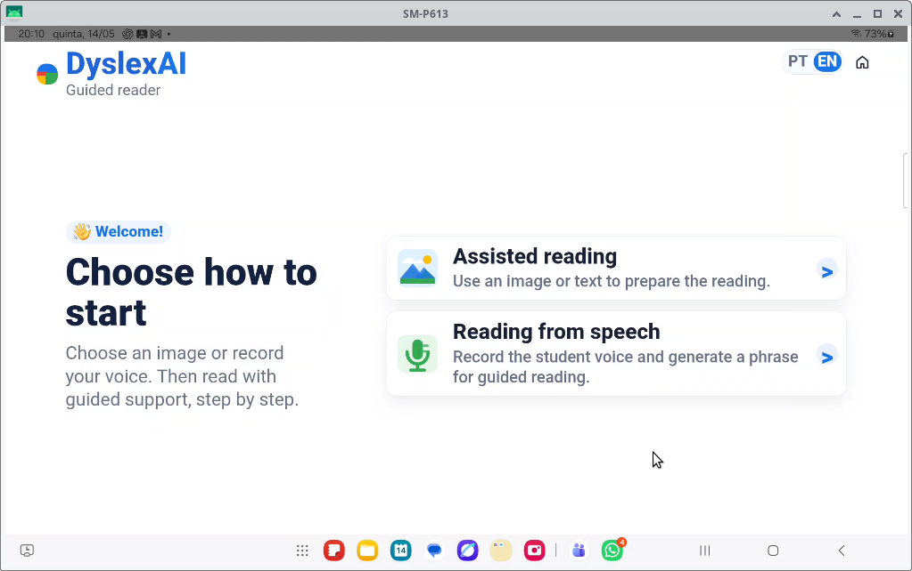
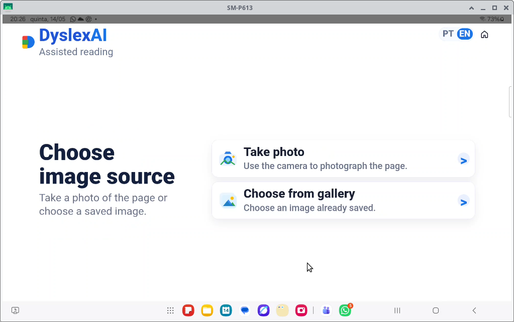
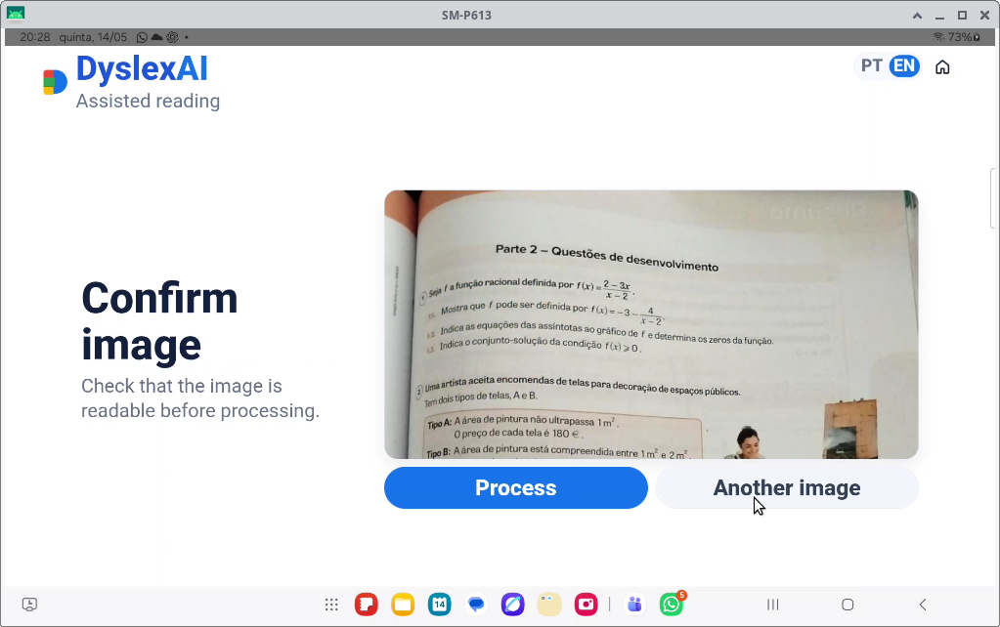
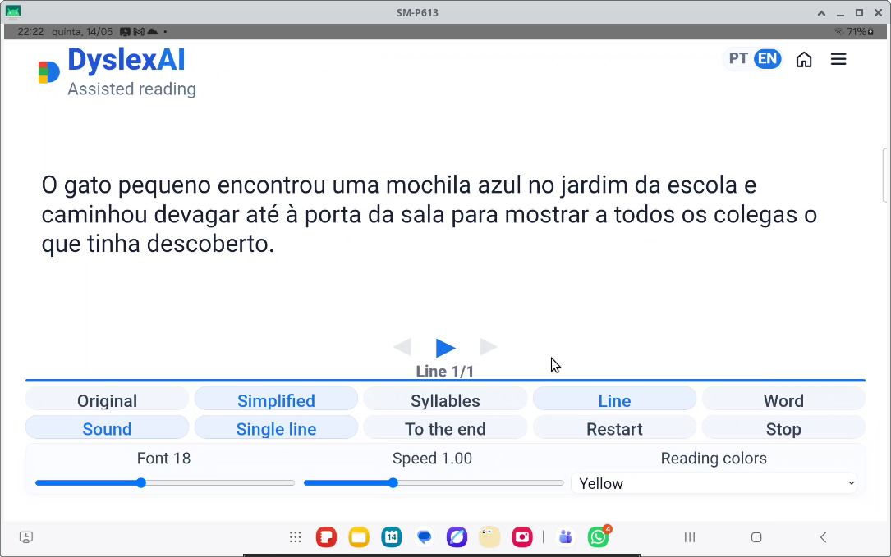
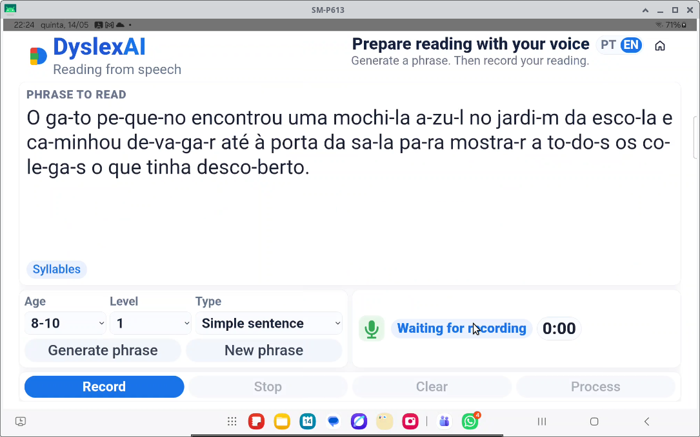
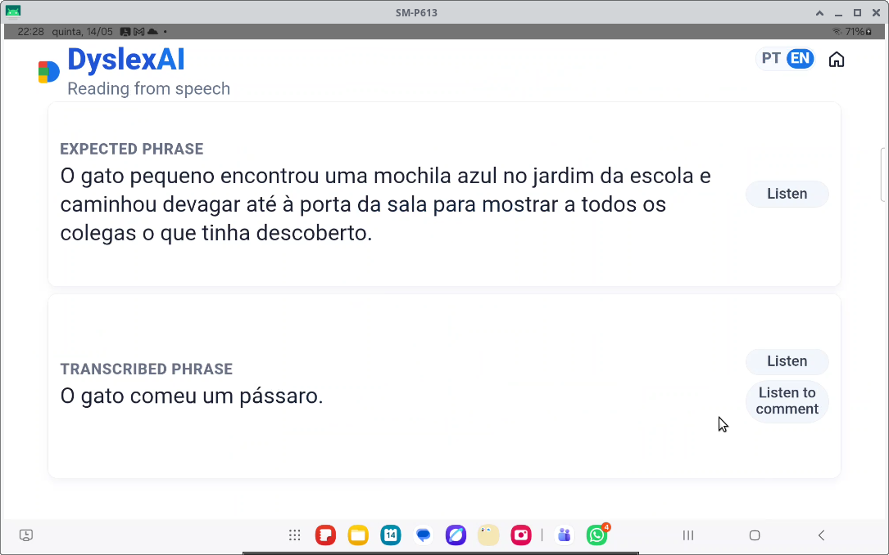

# DyslexAI — Demo Flow

This document describes the recommended demo flow for the DyslexAI Android hackathon version.

---

# 1. Home Screen

DyslexAI starts with a simple guided reading interface designed for accessibility and ease of use.

The user can choose between:

- assisted reading from an image
- reading support using speech interaction

---

# 2. Choose Image Source

The user can select how to provide the reading content.

Available options:

- take a photo
- choose an image from the gallery

This allows the app to work with school books, worksheets and printed educational material.

---

# 3. Confirm Image

Before processing, the user confirms that the selected image is readable.

This step helps ensure better local multimodal inference quality.

---

# 4. Simplified Guided Reading

Gemma 4 local inference is used to:

- understand the image
- extract the reading content
- simplify the text
- support guided reading

The guided reading interface supports:

- simplified reading
- syllable segmentation
- line-by-line reading
- word-by-word reading
- adjustable speed
- reading colors
- audio playback

---

# 5. Reading From Speech

The application also supports speech-oriented reading interaction.

The user can:

- generate a phrase
- read the phrase aloud
- record speech
- prepare guided reading exercises

This demonstrates the multimodal and educational capabilities enabled by Gemma.

---

# 6. Speech Feedback Results

After speech processing, the app can compare:

- expected phrase
- transcribed phrase

This supports reading practice and independent learning workflows.

The interface also supports audio feedback playback.

---

# Multimodal Gemma Capabilities

DyslexAI was designed to take advantage of multiple Gemma capabilities:

- multimodal image understanding
- text generation
- text simplification
- multilingual support
- speech-related interaction workflows
- prompt-driven task adaptation

The project demonstrates how prompt engineering and local inference can adapt Gemma to accessibility-focused educational scenarios.

---

# Final Hackathon Focus

The final version focuses on:

- Android local execution
- accessibility
- dyslexia-oriented reading support
- multilingual UI
- guided reading
- multimodal AI interaction
- privacy-friendly local inference